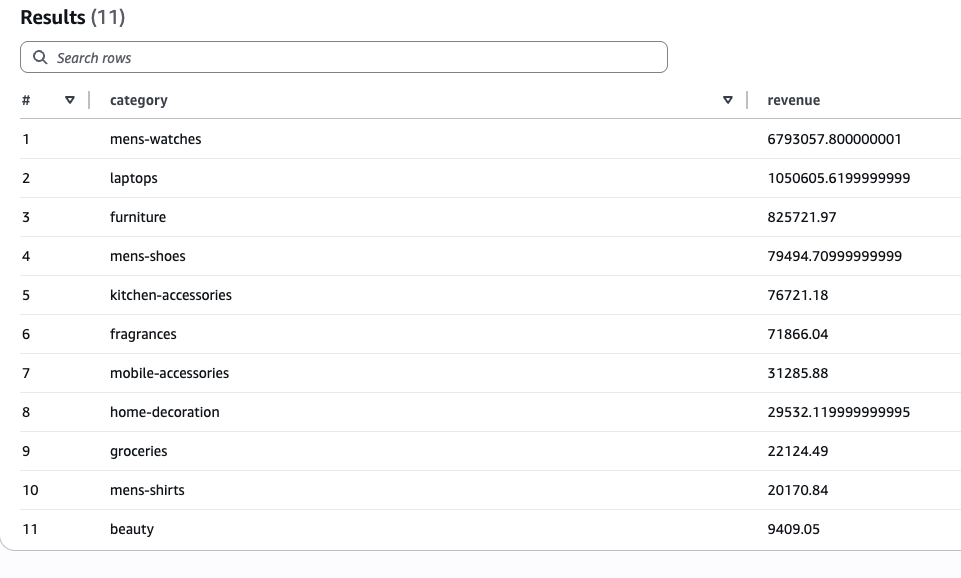
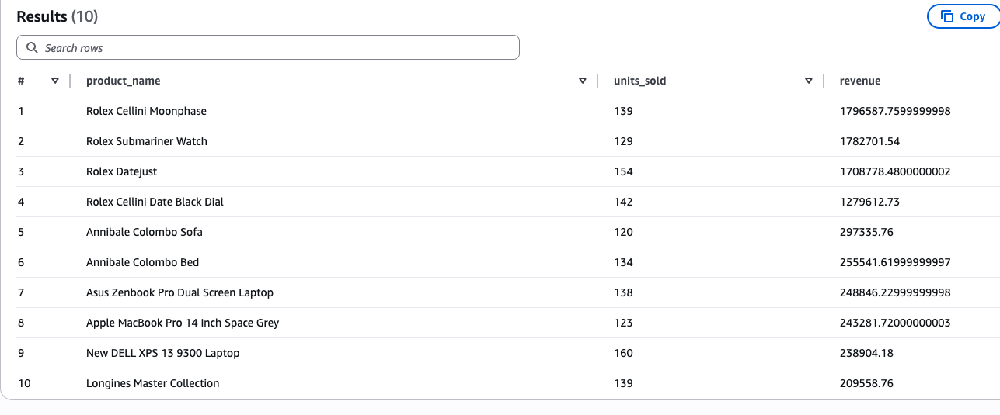
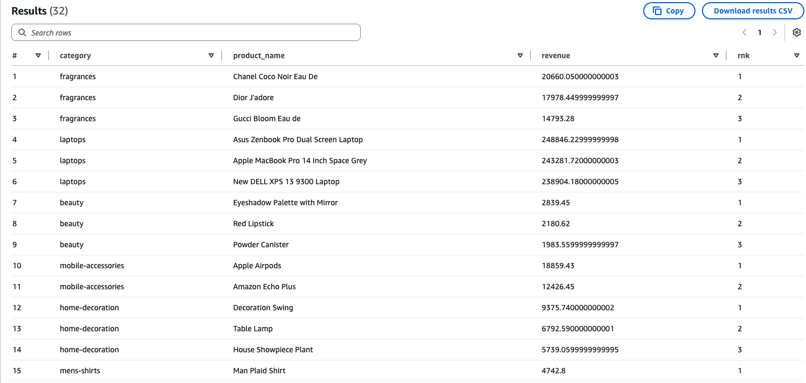
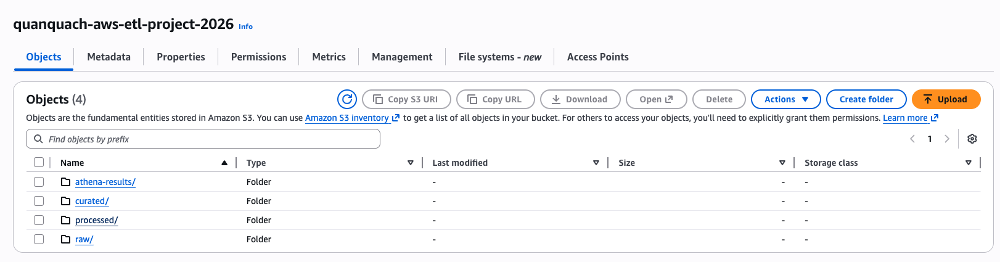
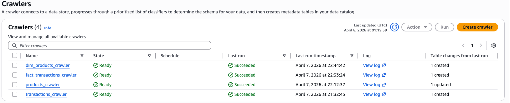
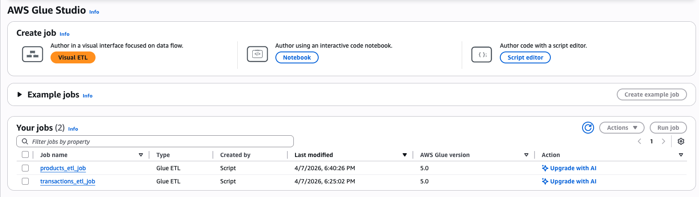

# AWS ETL Pipeline (E-commerce Data)

This is a small end-to-end data engineering project I built to practice working with AWS.

The goal was simple: take data from multiple sources (CSV + API), process it in the cloud, and run some analytics on top of it.

## What this project does

- Loads transaction data from CSV
- Fetches product data from an API using AWS Lambda
- Stores everything in S3 (raw + processed layers)
- Uses AWS Glue to transform data into Parquet
- Queries the data using Athena

Flow: CSV + API → S3 raw → Glue crawlers → Glue ETL → Parquet → Athena


## Tech stack
- Python
- AWS S3 (data lake)
- AWS Glue (ETL)
- AWS Lambda (API ingestion)
- AWS Athena (query)
- SQL

## Data sources

- Transactions: generated CSV data (simulating e-commerce orders)
- Products: fetched from API (DummyJSON)


## Pipeline flow

1. Transaction data is generated locally and uploaded to S3
2. Lambda fetches product data from API and writes to S3
3. Glue crawlers create tables in the Data Catalog
4. Glue ETL jobs transform data:
   - CSV → Parquet
   - JSON → structured table
5. Athena is used to query the final dataset

## Data modeling

I split the data into:

- `fact_transactions`: contains all transaction events
- `dim_products`: contains product info (name, category, price, etc.)

This makes it easier to run analytical queries (classic star schema setup).

## Example queries

### Revenue by category

```sql
SELECT
    p.category,
    SUM(t.total_amount) AS revenue
FROM fact_transactions t
JOIN dim_products p
    ON t.product_id = p.product_id
GROUP BY p.category
ORDER BY revenue DESC;
```


### Top products
```sql
SELECT
    p.product_name,
    SUM(t.total_amount) AS revenue
FROM fact_transactions t
JOIN dim_products p
    ON t.product_id = p.product_id
GROUP BY p.product_name
ORDER BY revenue DESC
LIMIT 10;
```



### Product ranking (window function)
```sql
WITH product_revenue AS (
    SELECT
        p.category,
        p.product_name,
        SUM(t.total_amount) AS revenue
    FROM fact_transactions t
    JOIN dim_products p
        ON t.product_id = p.product_id
    GROUP BY p.category, p.product_name
)
SELECT *
FROM (
    SELECT
        *,
        RANK() OVER (PARTITION BY category ORDER BY revenue DESC) AS rnk
    FROM product_revenue
) ranked
WHERE rnk <= 3;
```


## Project structure
```
├── scripts/        # data generation & API scripts
├── glue/           # ETL jobs (PySpark)
├── sql/            # Athena queries
├── lambda/         # Lambda function for API ingestion
└── README.md
```

## Infrastructure 





## Notes
This project is not meant to be production-ready, but it covers the full flow of a data pipeline on AWS.

If I had more time, I’d probably:
- add incremental loading
- schedule everything with EventBridge
- add some data quality checks


## Why I built this

Mostly to get hands-on with AWS data tools and understand how everything connects:
S3 → Glue → Athena → Lambda

